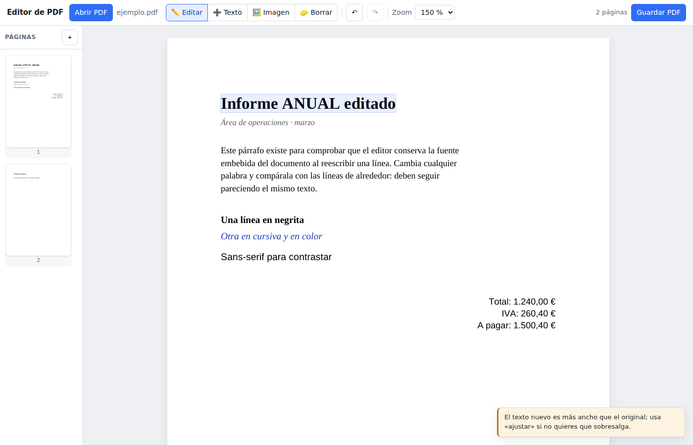
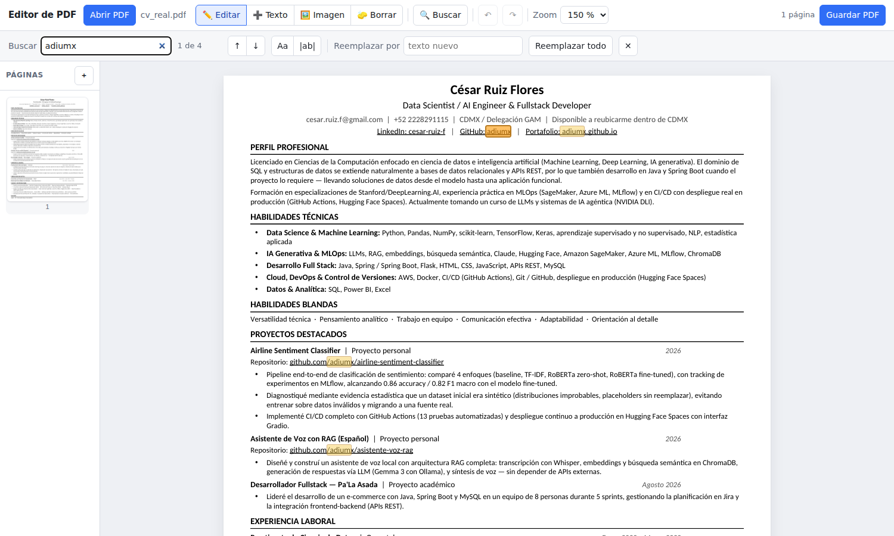

# Editor de PDF

Aplicación web local para **editar el texto de un PDF conservando su tipografía
original**. No superpone cajas de texto encima del documento: localiza el
programa de fuente que el propio PDF lleva embebido, borra los glifos antiguos y
vuelve a dibujar el texto nuevo con esa misma fuente, en la misma línea base, con
el mismo tamaño y el mismo color.

Los archivos se procesan en tu equipo y nunca salen de él.





## Instalación

```bash
git clone https://github.com/adiumx/pdf_editor.git
cd pdf_editor
python3 -m venv .venv && source .venv/bin/activate   # en Windows: py -m venv .venv && .venv\Scripts\activate
pip install -r requirements.txt
```

En Debian y Ubuntu la orden `python` no existe y `venv` viene en un paquete
aparte; si `python3 -m venv` falla, instálalo primero:

```bash
sudo apt install python3-venv
```

Una vez activado el entorno, `python` y `pip` funcionan con normalidad dentro de
él: los proporciona el propio entorno virtual.

## Uso

```bash
python run.py
```

Se abre `http://localhost:8000` en el navegador. Arrastra un PDF a la ventana y
empieza a editar.

Opciones: `python run.py --port 8080 --no-browser`.

### Desde una tablet, por la red local

```bash
python3 run.py --host 0.0.0.0
```

Escuchar en todas las interfaces en lugar de solo en la propia máquina. El
arranque imprime la dirección que hay que abrir desde el otro equipo
(`http://192.168.x.x:8000`). El PDF se queda en el ordenador: la tablet solo
enseña la página ya dibujada y manda de vuelta lo que tocas.

**No hay contraseña.** Cualquiera que alcance esa red puede abrir el editor,
subir archivos y leer los documentos que tengas abiertos, así que úsalo solo
en una red de confianza. Si no conectas, suele ser el cortafuegos del
ordenador: hay que dejar pasar ese puerto.

Todo funciona con el dedo. El editor escucha eventos de *puntero*, que es la
misma lógica para ratón, dedo y lápiz, en lugar de eventos de ratón, que un
dedo no produce. Con una herramienta que dibuja o mueve, el arrastre es suyo y
la página no se va detrás; con la de editar no se arrastra nada, así que el
scroll sigue siendo la forma de mover el documento. Lo que un hover habría
revelado se enseña desde el principio, porque en una pantalla táctil no hay
con qué pasar por encima, y en pantalla estrecha la tira de páginas se pone
horizontal arriba y la barra se reparte en dos líneas.

Dos cosas siguen pidiendo teclado: **empujar con las flechas** y **Mayús para
sumar a la selección**. Lo segundo tiene un interruptor propio —**＋ Sumar**,
junto a la herramienta Mover— que hace lo mismo quedándose pulsado. Lo primero
no: para afinar una posición a dedo están la cuadrícula y el ajuste.

## Qué puedes hacer

| Herramienta | Qué hace |
|---|---|
| **Editar** | Haz clic en cualquier texto y escribe encima. Conserva fuente, tamaño y color. |
| **Mover** | Arrastra un párrafo a otro sitio de la página. Sus enlaces y sus marcas viajan con él. Señala varios con Mayús y alinéalos o repártelos. |
| **Duplicar** | Copia lo señalado, un poco desplazado, dejando el original donde estaba. `Ctrl+D`. |
| **Texto** | Dibuja un rectángulo e inserta texto nuevo con la fuente que elijas. |
| **Imagen** | Sube una imagen y colócala dibujando un rectángulo. |
| **Formularios** | Los campos del documento se rellenan directamente: escribe, marca, elige. |
| **Anotar** | Resalta, subraya, tacha o deja una nota. Arrastra sobre el texto; clic en una marca para quitarla. |
| **Borrar** | Quita del archivo todo lo que haya dentro de un rectángulo, diciendo antes qué se lleva. |
| **Reconocer texto** | Lee el texto de las páginas escaneadas para poder editarlas. Aparece solo cuando hay alguna. |
| **Buscar** | `Ctrl+F` abre la búsqueda: resalta todas las apariciones, salta entre ellas y reemplaza todas de una vez. |
| **Páginas** | Reordena arrastrando las miniaturas, gira, borra o añade páginas en blanco. |
| **Cuadrícula** | `G` abre la regla: cuadricula la página, ajusta lo que muevas a sus líneas y a lo que ya hay escrito, y mide el desplazamiento mientras arrastras. |

Desde la barra de formato puedes cambiar la fuente, el tamaño, el color, la
negrita, la cursiva y la alineación. El desplegable de fuentes agrupa:

- **Fuentes del documento** — las que el PDF lleva embebidas.
- **Estándar del PDF** — Helvetica, Times y Courier. No hacen falta instalarlas:
  las tiene cualquier visor, así que el archivo no engorda y se ve igual en todas
  partes.
- **Instaladas en este equipo** — todas las que encuentre en tu sistema.
- **Genéricas** — sans-serif, serif y monoespaciada.

Si el desplegable se te queda corto, instala las familias libres más habituales;
además cubren por compatibilidad métrica a las de Microsoft (Arial, Times New
Roman, Calibri, Cambria):

```bash
sudo apt install fonts-liberation fonts-dejavu fonts-crosextra-carlito \
                 fonts-crosextra-caladea fonts-noto-core
```
La casilla **Ajustar** reduce el tamaño para que un texto más largo quepa en el
ancho original.

La búsqueda ignora mayúsculas y acentos por defecto: escribir «computacion»
encuentra «Computación». Los botones `Aa` y `|ab|` exigen coincidencia exacta o
palabra completa. Reemplazar todo es **un solo paso de deshacer**, y el texto
reemplazado se reajusta como cualquier otra edición.

### Duplicar un bloque

Con un párrafo señalado —o varios—, `Ctrl+D` o el botón **⧉ Duplicar** ponen
una copia justo al lado, un paso de la cuadrícula desplazada para que no caiga
encima del original. Se copian las palabras, cada una en su propia fuente; un
enlace o una marca que hubiera encima se quedan en el original, porque dos
enlaces abriendo la misma página desde dos frases —o dos resaltados sobre lo
que, duplicado, ya no es la misma idea— dirían algo que no es cierto.

### Seleccionar varios, alinear y repartir

Con la herramienta **Mover**, un clic señala un párrafo y **Mayús** (o `Ctrl`)
al hacer clic añade otro a la selección; volver a pulsar sobre uno lo saca, que
es como se deshace un clic errado sin empezar de cero. Un clic normal empieza
una selección nueva. La selección vive en una página: alinear un párrafo con
algo de otra hoja no significa nada.

Con dos o más señalados aparece la barra de alineación:

- **Izquierda, centro, derecha** y **arriba, medio, abajo**. El borde al que se
  va es el de más afuera —el más a la izquierda para «izquierda», el más alto
  para «arriba»—, porque es el que ya está en la página: todo se mueve a un
  sitio donde hay algo, en vez de ir todos a un sitio donde no estaba ninguno.
  Centrar usa el medio de lo seleccionado.
- **Repartir en horizontal o en vertical**, a partir de tres bloques. Los dos de
  los extremos se quedan donde están y el espacio sobrante se reparte a partes
  iguales entre los demás. Lo que se iguala son los huecos, no la distancia
  entre bordes, que es lo que el ojo lee como repartido.

Arrastrar uno de los bloques señalados los mueve todos: después de alinearlos,
separarlos sin querer sería absurdo. Las flechas también empujan la selección
entera. Sin teclado a mano, el botón **＋ Sumar** deja los toques sumando en
lugar de empezar una selección nueva.

### Borrar de verdad, y saberlo antes

Borrar una zona no es taparla. Un recuadro negro dibujado encima de un nombre
sigue teniendo el nombre debajo, a un copiar y pegar de distancia; aquí los
glifos salen del archivo, y una vez guardado no queda de dónde recuperarlos.
Es lo correcto, pero conviene estar seguro, así que antes de hacerlo se lee lo
que hay dentro del rectángulo y se dice en voz alta:

- **Cuántas palabras** y las primeras líneas, citadas literalmente, para que se
  vea qué desaparece.
- **Cuántas imágenes y dibujos**. La pintura de una anotación se cuela entre los
  dibujos de la página sin nada que la distinga, así que lo que cae dentro del
  recuadro de una anotación no se cuenta: no es línea de la página, y una
  redacción no lo toca de todas formas.
- **Qué NO se va**: las marcas y los campos de formulario que haya encima. No
  son contenido de la página y sobreviven, de modo que un resaltado sobre una
  frase borrada se queda señalando el hueco.

Mientras no guardes, **Deshacer** lo devuelve; al guardar, ya no.

Un rectángulo vacío no pregunta nada: avisa de que no hay nada dentro.

### Rellenar formularios

Si el PDF trae un formulario, sus campos aparecen sobre la página como lo que
son: una caja de texto donde escribir, una casilla que marcar, un desplegable
donde elegir. Están siempre activos, con cualquier herramienta en la mano,
porque rellenar un formulario no es una edición de la página y no compite con
ninguna.

- El valor se guarda al **salir del campo** o con `Enter`, no en cada tecla:
  cada guardado es un paso de deshacer, y uno por letra enterraría todo lo
  demás. `Esc` descarta lo escrito.
- Marcar un **botón de opción** desmarca a sus hermanos: comparten un valor,
  guardado una sola vez en el campo del que todos cuelgan.
- Un campo **de solo lectura** se dibuja con el borde a rayas y no deja
  escribir; uno **obligatorio**, con el borde rojo.
- Un campo con **límite de longitud** rechaza lo que no cabe en lugar de
  recortarlo en silencio, y uno de **lista cerrada** rechaza un valor que no
  esté entre sus opciones.
- Una **firma digital** se muestra como la dibuja el documento pero no se
  rellena: haría falta un certificado y una clave privada, que este editor no
  tiene.

El historial trata aparte las páginas con campos. Un campo no vive en la
página que lo enseña sino en la lista del documento, así que esa página no se
puede sacar y devolver por su cuenta —la copia vuelve mientras la original
sigue listada y el lector la renombra—, y un paso que la toque guarda el
documento entero. Se pregunta a la página y no al documento: así, en un
formulario largo, las páginas sin campos conservan su paso barato.

### Firmas digitales

Si el documento lleva una firma digital de verdad puesta —no sólo el hueco
para una— se avisa con una franja fija bajo la barra, con el nombre de quien
firmó: **editar el documento invalida la firma**. No es un aviso que
desaparezca solo; sigue ahí mientras el documento esté abierto, porque una
firma no vuelve a ser válida por esperar. Firmar de verdad, con un
certificado, queda fuera de este editor.

### Anotar

`A` abre la herramienta. Eliges el tipo de marca —resaltado, subrayado,
tachado, subrayado ondulado o nota— y su color, y **arrastras sobre el texto**
como con un rotulador: el gesto no tiene altura, y la marca toma la suya de la
línea por la que pasaste. Se marca desde donde entraste hasta donde saliste, así
que media frase queda como media frase, y se para en las palabras: por mucho que
el arrastre siga hasta el borde, no se pinta el margen vacío. Dos líneas
cruzadas reciben una marca cada una, no un rectángulo que se las come junto con
el espacio entre ellas.

Sobre algo que no es texto —una figura, una foto— se marca el rectángulo que
dibujes, que es lo que significa rodear una imagen.

Una **nota** es una chincheta: clic donde la quieras y escribe el texto.

Las marcas que ya trae el documento también se ven. Con la herramienta en la
mano se perfilan y un clic las quita; con cualquier otra son invisibles y no
estorban al texto de debajo. Todo ello se deshace como cualquier otra edición.

### Cuadrícula, ajuste y guías

`G` abre la barra de la cuadrícula. **Mostrar cuadrícula** raya la página con el
**paso** que elijas —de 1 mm a un cuarto de pulgada, en milímetros, puntos o
pulgadas, con la línea marcada más fuerte cada cinco— sin tocar el documento:
es una ayuda visual, no se guarda ni se imprime.

Con ella vienen dos ajustes, independientes y combinables:

- **Ajustar a la cuadrícula** lleva el bloque que arrastras a la línea más
  cercana. Se prueban sus seis bordes —izquierdo, centro y derecho, superior,
  medio e inferior— y gana el que menos haya que corregir, así que un bloque se
  pega a la cuadrícula por el lado que ya tenía más cerca.
- **Ajustar a márgenes y texto** lee las posiciones del propio documento —los
  bordes y el centro de cada línea, y el margen de la columna— y alinea con
  ellas. Es lo que hace que un párrafo movido quede a plomo con el resto de la
  página aunque el documento no siga ninguna cuadrícula. Un bloque nunca se
  alinea consigo mismo. Mientras arrastras, una línea rosa señala con qué se
  está alineando.

Un indicador junto al puntero va diciendo cuánto llevas movido, en las unidades
del paso elegido (`12.5 × 4.0 mm`), y **Mayús** mientras arrastras mantiene el
movimiento en un solo eje.

Un clic con la herramienta **Mover** señala el bloque sin desplazarlo; a partir
de ahí las **flechas** lo empujan un punto y **Mayús+flechas** un paso entero de
la cuadrícula, que es la forma de afinar una posición sin pelearse con el ratón.
`Esc` lo deselecciona.

Atajos: `V` editar · `M` mover · `T` texto · `I` imagen · `E` borrar · `A` anotar ·
`G` cuadrícula ·
`Ctrl+F` buscar · `Ctrl+Z` / `Ctrl+Mayús+Z` deshacer y rehacer · `Ctrl+S` guardar ·
`Enter` aplicar · `Esc` cancelar. Las letras sueltas no actúan mientras escribes en un
campo o en el propio documento.

## Cómo conserva la fuente

Al abrir el documento se extrae, de cada página, el programa de cada fuente
embebida (`extract_font`). Cuando editas una línea:

1. Se localiza el programa que dibujó ese texto, comparando nombres de forma
   tolerante: el PDF puede referirse a `LiberationSerif` mientras el programa se
   llama `Liberation Serif Regular`, o llevar el prefijo de subconjunto
   `ABCDEF+`. Los sufijos neutros (`Regular`, `MT`, `PS`…) se ignoran; el peso y
   la inclinación **nunca**, porque distinguen fuentes distintas.
2. Si el PDF **no** embebe esa fuente —cosa habitual: muchos documentos se
   limitan a nombrarla y confían en que el lector la tenga— se busca **esa misma
   fuente instalada en tu equipo**, por nombre. Y si no está, se recurre a su
   equivalente métricamente compatible: Arial → Liberation Sans, Times New Roman
   → Liberation Serif, Calibri → Carlito, y así. Lo que nunca se hace es elegir
   un reemplazo sólo por el estilo, que es como una Arial acaba convertida en
   cualquier otra sans.
3. Se comprueba que esa fuente tenga glifos para lo que has escrito. Si no los
   tiene (por ejemplo, un subconjunto sin `ñ`), se busca otra fuente del
   documento con el mismo estilo, luego una del sistema y, por último, una de las
   14 estándar del PDF — y se te avisa de la sustitución.
4. La sustituta casi nunca es del mismo ancho que la fuente a la que reemplaza
   —Carlito es compatible con Calibri, Liberation Sans con Arial, y entre sí no
   lo son—, así que el texto se **comprime horizontalmente** hasta ocupar
   exactamente lo que ocupaba el original. El factor no se adivina: se mide del
   propio documento, comparando lo que el PDF declara que ocupa su texto con lo
   que necesitaría la sustituta, y se toma la mediana de todo el página. Sin
   esto, una línea reescrita sin cambiarla salía un 11 % más larga y arrastraba
   el reajuste de párrafos que nadie había tocado.
5. Si pides negrita o cursiva y la familia elegida no tiene ese corte instalado,
   se conserva **el corte** y se cambia de familia, no al revés: pedir cursiva y
   obtener texto redondo no es una respuesta. Se te indica el cambio.
6. Se borran los glifos originales con una redacción y se redibuja el texto en la
   línea base original, reutilizando el programa de fuente **byte a byte**, de
   modo que el PDF guardado sigue siendo válido en cualquier visor.

Los cambios de una misma página se agrupan: primero todos los borrados y después
todos los redibujados, para que una edición no se coma el texto que otra acaba de
escribir.

**El texto se reparte entre las líneas.** Si al editar un renglón deja de caber,
el párrafo se vuelve a partir: las palabras sobrantes bajan a las líneas
siguientes en lugar de salirse por el margen. Mientras quepa, no se toca nada
más que el renglón editado. El botón **⤶ Reajustar** fuerza el reparto cuando
quieres recolocar un párrafo que se ha quedado con huecos.

El ancho al que se reparte no es el del párrafo, sino el de **su columna**: lo
que alcanzan los demás párrafos que arrancan en el mismo margen. Un párrafo de
dos líneas cortas mide poco por sí mismo y se reajustaría en una columna más
estrecha que aquella en la que está.

Si al crecer no cabe en el hueco que tiene debajo —que se mide mirando qué hay
realmente ahí, no suponiéndolo—, primero se **comprime el interlineado**, que se
nota mucho menos que cambiar el cuerpo de letra. Si aun así no cabe, el
desplegable **«Si no cabe»** decide qué hacer:

| Opción | Qué hace |
|---|---|
| **avisar** | Deja que el párrafo crezca y te lo dice. |
| **reducir el tamaño** | Encoge la letra hasta que quepa, nunca por debajo de la mitad. |
| **mover lo de abajo** | Desplaza hacia abajo el texto, los filetes y los enlaces que estorban. |

Mover lo de abajo arrastra el texto, los filetes, las curvas, los cuadriláteros
y las imágenes que estén en la misma columna. Lo que ya no cabe en la hoja pasa
a una **página de continuación** insertada justo después, con sus enlaces:
empujarlo más allá del borde sería sencillamente esconderlo. Se ofrece una vez,
no una cadena de páginas a medio llenar, y se niega sin tocar nada ante un trazo
que no sabe recolocar. Media figura en su sitio viejo es peor que un párrafo que
sobresale.

Un párrafo se reconoce por sus propias señales: mismo tipo y tamaño de letra,
el interlineado propio del bloque, el mismo margen izquierdo y —la más
reveladora— que la línea anterior llegara hasta el margen derecho en vez de
quedarse corta, porque una línea corta es donde termina un párrafo. Así un
titular pegado a un cuerpo de texto no se arrastra dentro de él.

**Sólo se redibuja lo que hace falta.** Si editas la parte final de una línea —el
caso típico: «**Habilidades:** Python, SQL…»—, lo que hay antes se queda tal cual
en la página, sin volver a dibujarse. Importa cuando las fuentes del documento no
se pueden reutilizar: si se reescribiera la línea entera, verías cambiar de
tipografía palabras que no tocaste. En una línea centrada o alineada a la derecha
no se puede: al cambiar el ancho se mueve todo, así que ahí sí se rehace entera.

**Los enlaces se conservan.** Borrar el texto de una línea se lleva por delante
los hipervínculos que hubiera encima, así que se guardan antes y se vuelven a
colocar sobre el texto nuevo, manteniendo su posición relativa dentro de la
línea. Si en cambio borras la línea entera, el enlace desaparece con ella: no
queda nada que pulsar.

## PDF escaneados

Un escaneo no tiene texto: tiene una **fotografía** de un texto, y no hay nada
que editar en ella. El botón **🔎 Reconocer texto** aparece cuando el documento
trae páginas así, y les pone encima una capa de texto legible.

A partir de ahí se edita como cualquier otra página, con una diferencia que
importa: al borrar una línea hay que **tapar también los píxeles** de debajo, o
la palabra escaneada seguiría viéndose bajo lo que la sustituye. La zona editada
queda en blanco, que es lo que hace cualquier editor.

El reconocimiento no guarda con qué tipografía estaba escrito el original
—nadie puede saberlo mirando una foto—, así que el texto que escribas usará una
fuente neutra hasta que elijas otra en la barra de formato.

Necesita Tesseract. En Debian o Ubuntu:

```bash
sudo apt install tesseract-ocr tesseract-ocr-spa
```

Si no está instalado, el editor te lo dice en lugar de fallar.

## Limitaciones
- **El ancho de la columna se deduce del propio texto**, porque el PDF no guarda
  márgenes. Es una estimación buena en un documento corriente, pero una página
  con bloques muy dispares en el mismo margen puede confundirla.
- **Se recolocan líneas, rectángulos, curvas, cuadriláteros e imágenes.** Ante
  un recorte o un sombreado, se niega a mover en lugar de dejarlo descolocado.
- **La página de continuación es una, no una cadena.** Si lo que se lleva no
  cabe tampoco allí, se te avisa en lugar de repartirlo por media docena de
  páginas nuevas.
- **Las fuentes en subconjunto** solo contienen los glifos que el documento usaba.
  Si escribes caracteres que no están, se sustituye la fuente y se avisa. Muchos
  subconjuntos, además, vienen sin tabla de caracteres Unicode —se direccionan
  por índice de glifo— y entonces no se pueden usar para escribir texto nuevo en
  absoluto; en ese caso se recurre a esa misma fuente instalada en tu equipo, o a
  su equivalente métrico.
- **Si el PDF no embebe sus fuentes**, el texto que edites sí quedará embebido.
  Es lo correcto —así se ve igual en cualquier visor—, pero significa que en un
  equipo sin esa fuente instalada el texto editado se verá bien y el resto no.
  Para evitarlo, edita el documento entero o parte de uno que sí embeba.
- **El texto en trazado o en imagen** no es editable, porque no es texto.
- **Las marcas viajan con el texto que marcan.** Al mover un párrafo, sus
  resaltados, subrayados, tachados y notas se van con él; las que cubren otra
  cosa se quedan donde estaban. Un formulario relleno se conserva intacto,
  aunque el historial de un documento con formulario cuesta más memoria: no se
  puede sacar y devolver una sola página sin romper la lista de campos.
- **Un enlace sobrevive a la edición de su línea aunque borres el texto que
  describía**, recolocado proporcionalmente. Se prefiere conservarlo a adivinar
  que ya no hace falta; si sobra, deshaz o bórralo desde otra herramienta.
- Los PDF protegidos con contraseña requieren la contraseña al abrirlos.
- **La búsqueda no cruza saltos de línea.** Una expresión partida entre dos
  renglones no aparece: las palabras están, pero el archivo nunca las unió y
  adivinar dónde va la unión daría resultados que no se ven en la página.
- Los documentos viven en memoria del servidor y se descartan tras dos horas sin
  actividad. Al salir de la página se te avisa si hay cambios sin guardar, pero
  **guarda antes de cerrar**.

## Arquitectura

```
app/
  main.py      API HTTP (FastAPI): subir, renderizar, leer texto, aplicar cambios, guardar
  store.py     Documentos abiertos en memoria, historial de deshacer y limpieza por inactividad
               (cada paso guarda sólo las páginas que cambiaron)
  extract.py   Lectura de la página como líneas y spans editables, con su geometría
  search.py    Búsqueda en el documento y reemplazo
  fonts.py     Localización, validación y reutilización de las fuentes embebidas
  editor.py    Aplicación de las operaciones sobre el PDF
  forms.py     Lectura y relleno del formulario del documento; quién firmó
  ocr.py       Reconocimiento del texto de páginas escaneadas
  static/      Interfaz (JavaScript sin dependencias ni compilación)
               js/grid.js:  cuadrícula, ajuste y guías (sólo en el navegador)
               js/align.js: alinear y repartir — geometría pura, sin tocar la página
```

El navegador no sabe nada de PDF: muestra la página renderizada por el servidor,
deja escribir encima y devuelve **operaciones** que describen el cambio. Después
de cada operación vuelve a pedir la página, así que lo que ves siempre es el
archivo real, nunca una simulación.

## Desarrollo

```bash
pip install -r requirements.txt pytest httpx playwright
python tools/make_sample_pdf.py ejemplo.pdf   # PDF de prueba con fuentes embebidas
pytest
```

(Con el entorno virtual activado. Sin él, usa `python3` y `pip3`.)

La suite cubre la resolución de fuentes, la extracción con páginas rotadas, cada
operación de edición y la API completa, incluida la comprobación de que el PDF
guardado sigue llevando la fuente embebida.

`tests/test_ui.py` conduce la interfaz en un navegador real **con ratón y teclado
de verdad**. Existe porque las pruebas que fijan valores por el DOM no detectan
toda una clase de fallo: una barra de formato cuyos controles no se pueden
pulsar las pasa todas. Se omiten solas si no hay Playwright o navegador
instalado; para ejecutarlas:

```bash
pip install playwright && playwright install chromium
```
